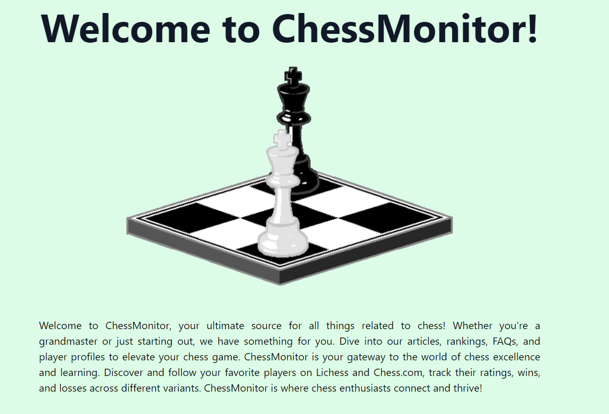
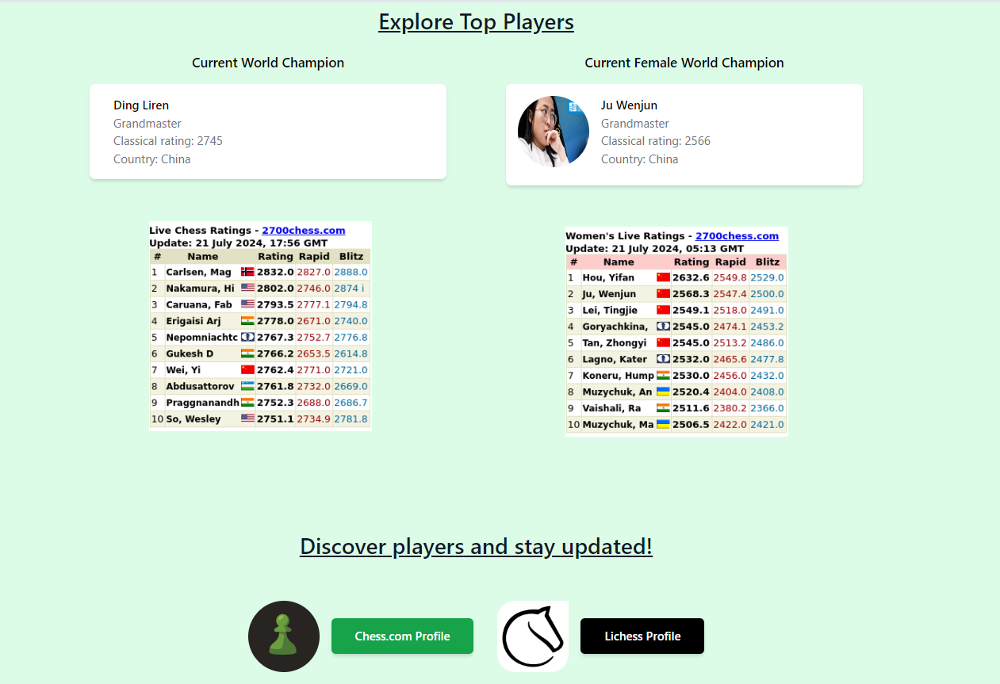

# ChessMonitor

**ChessMonitor** is an application designed to help chess enthusiasts track their games and stay updated with the latest standings in the chess world. This application allows users to monitor their chess games across various platforms and view detailed statistics. Built with React and Tailwind CSS, ChessMonitor offers a user-friendly interface and seamless experience for all chess lovers.

## Features

### User Features
- **Game Tracking:** Monitor chess games from various platforms.
- **Statistics:** View detailed statistics about your chess performance.
- **Latest news:** Access the latest standings of players in the chess world.

## Screenshots

Here are some screenshots of the BookVerse application:

### Homepage


### Top Chess Players


### Chess.com Profile Tracker


### Lichess Profile Tracker


### About Page


## Tech Stack

- **Frontend:** React, Tailwind CSS
- **Deployment:** Netlify

## Installation

### Prerequisites

- Node.js (v14 or later)
- npm (v6 or later)

### Setup

1. **Clone the Repository:**

    ```bash
    git clone https://github.com/samreen-19/ChessMonitor.git
    cd ChessMonitor
    ```

2. **Setup Frontend:**

    - Navigate to the project directory:

        ```bash
        cd ChessMonitor
        ```

    - Install dependencies:

        ```bash
        npm install
        ```

    - Start the frontend application:

        ```bash
        npm run dev
        ```

## Usage

To use the ChessMonitor application locally:

1. Ensure you have the frontend running on your local machine.
2. Open your web browser and navigate to `http://localhost:3000` (or the port specified in your frontend configuration).
3. **Track Games:** Enter your username for platforms like Lichess or Chess.com to track your games.
4. **View Statistics:** Access your performance statistics in a user-friendly dashboard.
5. **Stay Updated:** Access the rankings and ratings of top chess players real time.
## Deployment

- **Frontend:** Deployed on [Netlify](https://www.netlify.com/). For deployment, follow Netlify’s deployment guide.

## License

This project is licensed under the MIT License - see the [LICENSE](LICENSE) file for details.

